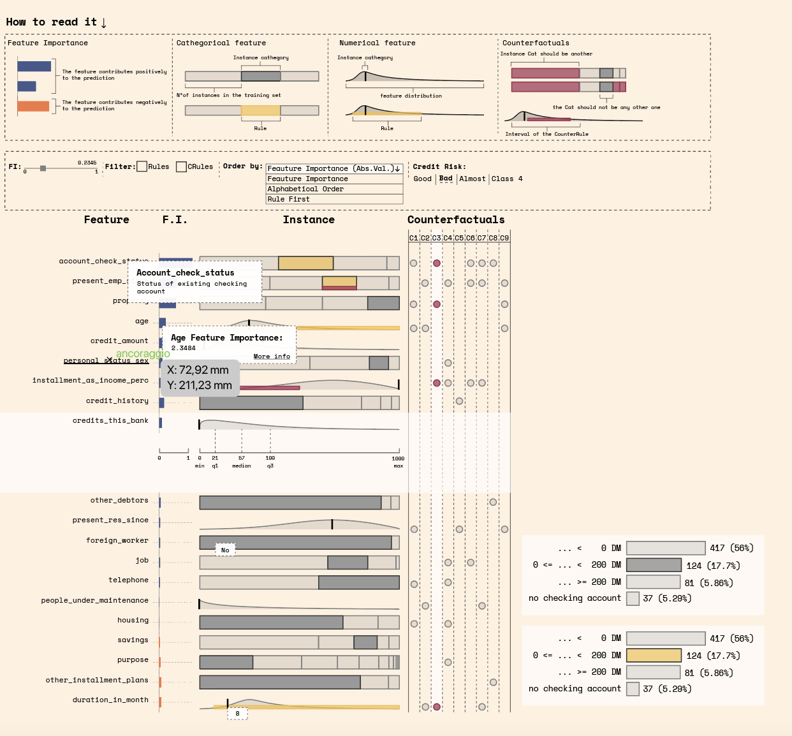

# d3_sandbox - FIPER Visualization

> Interactive D3.js-based visualization for FIPER (Feature Importance and Predicates for Explainable Rules)

This project provides a comprehensive web-based interface for exploring and understanding XAI (Explainable AI) results through interactive visualizations. The interface displays feature importance, rule-based explanations, counter-factual rules, and data distributions in an intuitive visual format.

## Table of Contents

- [Overview](#overview)
- [Build Setup](#build-setup)
- [Code Architecture](#code-architecture)
- [Key Features](#key-features)
- [File Structure](#file-structure)
- [Component Documentation](#component-documentation)
- [Data Format](#data-format)
- [Customization](#customization)

## Overview

The FIPER visualization transforms complex machine learning explanations into an interactive interface that helps users understand:
- **Why** the model made a specific prediction (factual rules)
- **What changes** would lead to different predictions (counter-rules)
- **How important** each feature is to the prediction
- **What values** features can take and their distributions



## Build Setup

``` bash
# Install dependencies
npm install

# Serve with hot reload at localhost:8080
npm run dev

# Build for production with minification
npm run build

# Build for production and view the bundle analyzer report
npm run build --report
```

For detailed webpack configuration, check out the [Vue.js webpack template guide](http://vuejs-templates.github.io/webpack/) and [vue-loader docs](http://vuejs.github.io/vue-loader).

## Code Architecture

The codebase follows a modular, component-based architecture using D3.js's reusable chart pattern. Each visual element is encapsulated as a configurable function that can be applied to D3 selections.

### Core Modules

#### `main.js` - Entry Point
- Initializes the visualization interface
- Handles data loading from JSON files
- Manages the instance selector dropdown
- Coordinates between data and visualization

#### `constants.js` - Configuration
- Layout dimensions (column widths, heights, gutters)
- Font sizes and spacing constants
- Color palettes (light, dark, high-contrast)
- Global event dispatcher for user interactions

#### `utilities.js` - Helper Functions
- Text processing and wrapping for SVG display
- Predicate-to-text conversion for readable explanations
- Column layout management system
- Formatting utilities for tooltips and labels

#### `fiper.js` - Main Visualization Components
The largest file containing all core visualization components:
- **TooltipHandler**: Reusable tooltip system with hover effects
- **FIPERFeatureInstanceValueView**: Markers showing actual instance values
- **FIPERFeatureDistributionView**: Distribution displays (categorical/numerical)
- **FIPERRulePredicateView**: Visual representation of rule predicates
- **FIPERFeatureLabelsView**: Feature names and values
- **FIPERFeatureImportanceView**: Feature importance bars
- **FIPERCRuleGrid**: Counter-rule selection grid
- **FIPERView**: Main orchestrator combining all components
- **preprocessData**: Data transformation pipeline
- **InstanceView**: Top-level component tying everything together

#### `fiper_menu.js` - UI Control Components
Menu and interaction components:
- **FiperMenuCRule**: Counter-rule selector buttons
- **FiperMenuOrderBy**: Feature ordering controls (importance, alphabetical, etc.)
- **FiperMenuFilterBy**: Show/hide features based on rules
- **FiperChooseTextualFormat**: Toggle graphical/textual explanations
- **FiperMenuProgressHandler**: Progressive disclosure controls
- **FiperClassificationBox**: Prediction result display
- **FiperMenuColumnTitles**: Section headers
- **FiperMenuPaletteSelector**: Color theme switcher
- **FiperMenu**: Main menu orchestrator

## Key Features

### 1. Interactive Feature Exploration
- Click any feature row to expand/collapse detailed information
- View distribution statistics for both categorical and numerical features
- See how the instance value compares to the overall distribution

### 2. Rule-Based Explanations
- **Factual Rules (R0)**: Explain why the prediction was made
- **Counter-Rules (C0, C1, ...)**: Show what changes would lead to different predictions
- Visual overlays show which parts of feature distributions rules cover

### 3. Feature Importance
- Horizontal bars show positive (green) and negative (brown) importance
- Expanded view shows detailed scale with the exact importance value
- Consistent scale across features for easy comparison

### 4. Multiple Display Modes
- **Graphical**: Visual distributions, bars, and charts (default)
- **Textual**: Natural language explanations of rules
- Switch seamlessly between modes

### 5. Flexible Ordering and Filtering
- Sort by: Feature importance, alphabetical, rules, counter-rules
- Filter to show only features with specific rules
- Combine filters for precise exploration

### 6. Accessible Design
- Three color palettes: Light, Dark, and High-Contrast (colorblind-friendly)
- Tooltips provide additional context on hover
- Progressive disclosure helps users learn incrementally

### 7. Progressive Explanation
Step through the explanation in stages:
1. **Classification**: See the prediction
2. **Feature Values**: View all features
3. **Rules**: Add rule-based explanations  
4. **Counter Rules**: Explore alternatives
5. **Feature Importance**: Add importance scores

## File Structure

```
d3_sandbox/
├── src/
│   ├── main.js              # Entry point, data loading
│   ├── constants.js         # Configuration and constants
│   ├── utilities.js         # Helper functions
│   ├── fiper.js            # Main visualization components
│   └── fiper_menu.js       # Menu and control components
├── static/                  # Static assets and data files
├── build/                   # Webpack build configuration
├── config/                  # Environment configuration
├── index.html              # HTML entry point
├── package.json            # Dependencies and scripts
└── README.md              # This file
```

## Component Documentation

### Reusable Chart Pattern

All visualization components follow D3's reusable chart pattern:

```javascript
function MyComponent() {
  // Configuration variables with defaults
  let width = 100;
  let height = 50;
  
  // Main rendering function
  function my(selection) {
    // Render logic using selection.datum()
    selection.selectAll('rect')
      .data(d => d.values)
      .join('rect')
      .attr('width', width)
      .attr('height', height);
  }
  
  // Getter/setter methods for configuration
  my.width = function(_) {
    return arguments.length ? (width = _, my) : width;
  };
  
  my.height = function(_) {
    return arguments.length ? (height = _, my) : height;
  };
  
  return my;
}

// Usage
const component = MyComponent().width(200).height(100);
d3.select('#container').datum(data).call(component);
```

### Event System

Components communicate via D3's event dispatcher defined in `constants.js`:

```javascript
// Emit event
dispatcher.call('changeCounterRule', this, counterRuleId);

// Listen for event
dispatcher.on('changeCounterRule', (ruleId) => {
  // Handle counter-rule change
});
```

Available events:
- `changeCounterRule`: User selects a different counter-rule
- `changeOrder`: User changes feature ordering
- `changeFilter`: User applies/removes filters
- `changePalette`: User switches color theme
- `changeTextualFormat`: User toggles display mode
- `changeProgressStep`: User navigates explanation steps

## Data Format

The visualization expects JSON data with the following structure:

```javascript
{
  "predicted_class": "class_label",
  "predicted_proba": {
    "class_0": 0.3,
    "class_1": 0.7
  },
  "features": [
    {
      "name": "feature_name",
      "rname": "readable_name",
      "type": "categorical" | "numeric",
      "feature_importance": 0.15,
      "instance_value": 1,
      "eda": {
        // For categorical:
        "category": "value",
        "count": 100,
        
        // For numerical:
        "min": 0, "q1": 25, "median": 50, 
        "q3": 75, "max": 100
      },
      "rule": [...],        // Factual rule predicates
      "crules": {           // Counter-rule predicates
        "C0": [...],
        "C1": [...]
      }
    }
  ]
}
```

## Customization

### Adjusting Layout

Modify constants in `constants.js`:

```javascript
export const SINGLE_FEATURE_HEIGHT = 30;  // Row height
export const FI_COLUMN_WIDTH = 75;        // Feature importance column
export const RULES_COLUMN_WIDTH = 300;    // Main visualization area
export const LABELS_COLUMN_WIDTH = 250;   // Feature labels
export const FONT_SIZE = 11;              // Base font size
```

### Adding Color Palettes

Add new palettes to the `colorSet` object in `constants.js`:

```javascript
export const colorSet = {
  // ...existing palettes
  myCustomPalette: {
    BACKGROUND_COLOR: '#ffffff',
    TEXT_COLOR: '#000000',
    // ...other colors
  }
};
```

Then add the palette option in `fiper_menu.js` `FiperMenuPaletteSelector`.

### Extending Components

To add new visualization components:

1. Create a new component function following the reusable chart pattern
2. Add configuration methods (width, height, etc.)
3. Integrate into `FIPERView` or `FiperMenu`
4. Wire up event handlers if needed

## Contributing

When contributing code:
- Follow the existing code style and patterns
- Add JSDoc comments for new functions
- Test with different data types (categorical/numerical features)
- Verify all three color palettes work correctly
- Ensure responsive behavior with different numbers of features

## License

[Include license information here]
